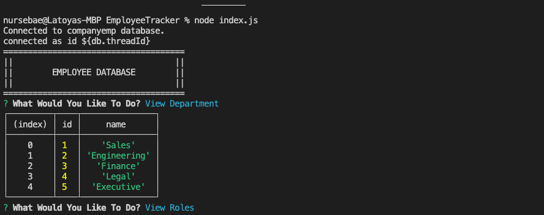
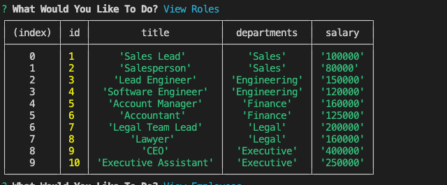
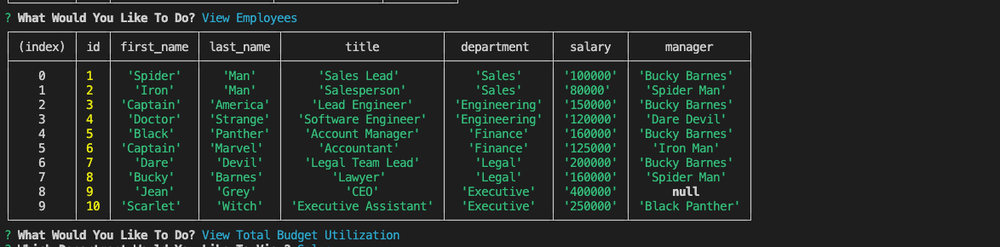

# EmployeeTracker

## description

This application is a command line interface where users can manage a company's employee database bu selecting the respective choice from command line.  MYSQL database is used to connect database. Console.Table is used to print mysql data in formatted way to console. 

  ## Table of Contents 
  - [Installation](#installation)
  - [Usage](#usage)
  - [Deployment](#deployment)
  - [Test](#test)
  - [Technologies](#technologies)
  - [License](#license)

## Installation:

Clone Repo:

npm install

To view database from MYSQL.

Run mysql -u root -p

## Usage:

This application will allow user to view, edit and delete employees, roles and department tables.
Here, walk through video of complete application along with screenshots.

https://drive.google.com/file/d/13rzyZODjjzSR2sGSLZSLJLBZxSbibogZ/view?usp=share_link 

Screenshots!

## Test:
  There are no test for this application.
  
  
## Technologies:
  - Inquirer
  - Console.Table
  - NodeJS
  - MYSQL

 
  ## License:
  License used for this project - Apache License 2.0  
  For more information on license types, please reference this website.  
  <a href="LICENSE"> Apache-2.0 </a>

  ## Repository Link

https://github.com/NickMagarian/flock_together
